# ray-tracer

Progress from initial rough output to final polished image: All of the output generated following the code from this tutorial: https://raytracing.github.io/books/RayTracingInOneWeekend.html#surfacenormalsandmultipleobjects. Now I have a very high-level overview of what's involved in developing a ray tracer and I'm planning to improve and render different images.

1. **Background gradient**  
   

2. **Full scene**  
   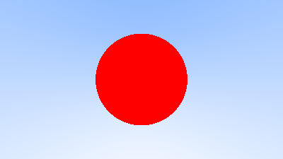

3. **Shading**  
   

4. **With ground**  
   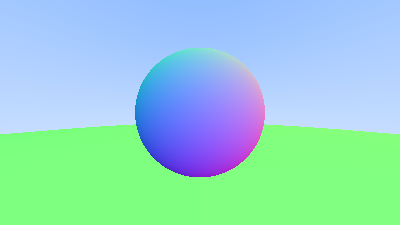

5. **Antialiasing**  
   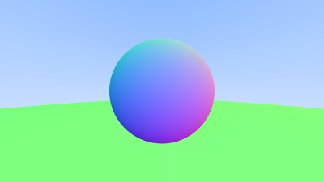

6. **Gray sphere**  
   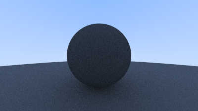

7. **Improved diffusion**  
   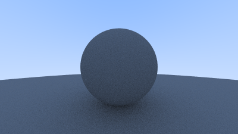

8. **Lambertian diffusion**  
   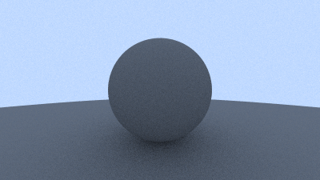

9. **Hollow glass**  
   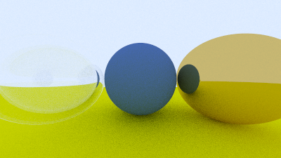

10. **Refracted**  
    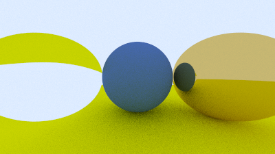

11. **Internal reflection**  
    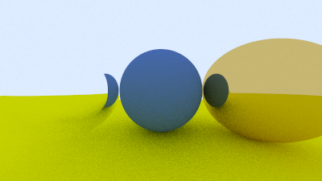

12. **Light reflection**  
    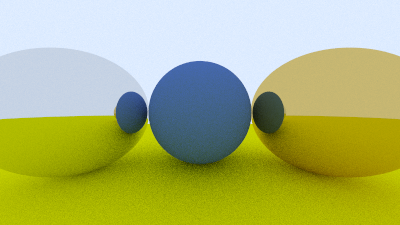

13. **Final polished**  
    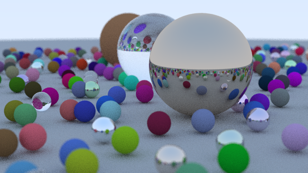

---

- it's become so clear now that the syntax is not a problem. it found it very easy to understand what's going on in the `vec3.h` file because i know the foundational concept of object-oriented programming and interface. now i see why people say understanding one language well (in my case is Python) can help you grasp other programming languages fairly easily.
- on a high level, a ray tracing consists of these core components:
  - **ray generation**: the camera shoots rays to the pixels of an image. we need to define the position of the camera, where it's looking, and the virtual viewport
  - **ray-scene intersection**: what the ray hits and where
  - **material/shading**: what color it is, how rough, metallic, or transparent -> this is important because it defines how light scatters on the object surface
  - **light transport**: when a ray hits a surface, it doesn't just stop — it spawns new rays. A mirror spawns a reflection ray. Glass spawns a refraction ray. A diffuse surface spawns rays in random directions to gather indirect light from the rest of the scene. This is _recursive_ and is the core of what makes ray tracing look realistic. The number of times a ray is allowed to bounce is called the ray depth.
  - **image reconstruction**: the radiance values collected by all the rays through a pixel need to be combined into a final pixel color by averaging multiple samples/pixel (antialising) -> tone mapping + gamma correction.
